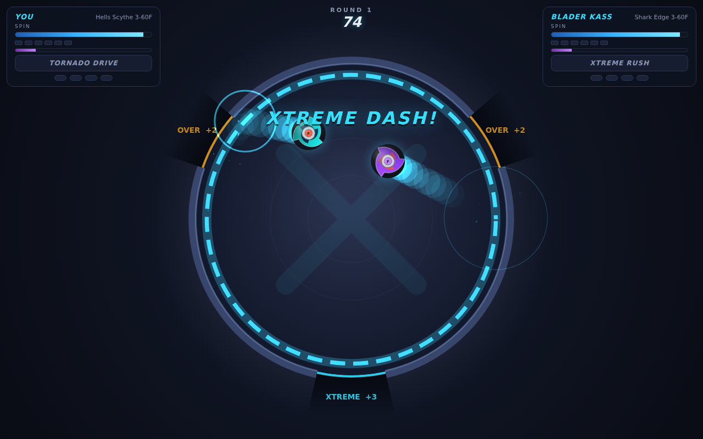
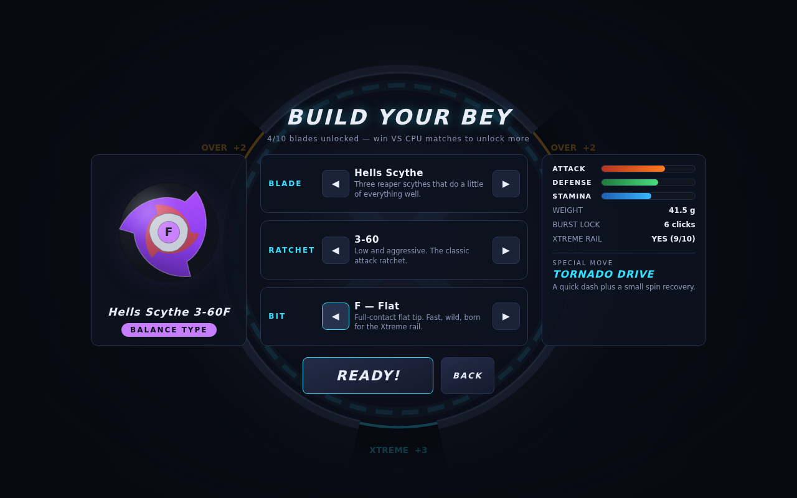

# BEYBLADE X — Digital Battle ⚡

A fully interactive, physics-driven digital Beyblade X game. No installs, no
dependencies, no assets — one folder of vanilla HTML/CSS/JS with a canvas
battle engine, procedurally drawn beys and fully synthesized sound.

> Unofficial fan project. Beyblade X is a trademark of Takara Tomy / Hasbro —
> this is a non-commercial homage for fun.




## ▶️ Play

Open `index.html` in any modern browser. That's it.

Or serve it (nicer for some browsers):

```bash
cd Sebs-Fun-Stuff
python3 -m http.server 8000
# open http://localhost:8000
```

Works great as a GitHub Pages site too — enable Pages on this repo and play in
the browser.

## 🎮 How it plays

1. **Build your bey** from three real-X-style parts:
   - **Blade** — Attack / Defense / Stamina power and weight
   - **Ratchet** (like `3-60`) — burst lock strength and height
   - **Bit** — the tip: Flat tips race the stadium and catch the **Xtreme rail**,
     Ball/Orb tips out-spin everyone, Needle/Dot tips anchor and tank hits
2. **Launch**: stop the oscillating power meter as close to the top as you can.
   97%+ is a **MAX launch**.
3. **Battle** is a real-time physics sim: bowl forces, collisions, recoil,
   spin drain, burst clicks and the signature **X-dash** — ride the glowing
   rail, accelerate, and slingshot across the stadium.
4. **Special moves**: your gauge fills over time and with every clash. Fire it
   with <kbd>SPACE</kbd> (P2: <kbd>ENTER</kbd>) or by tapping your side of the
   screen:
   - Attack → **XTREME RUSH** (instant dash at the opponent)
   - Defense → **IRON WALL** (2.5s of near-immunity)
   - Stamina → **SPIN SURGE** (recover spin)
   - Balance → **TORNADO DRIVE** (dash + small spin recovery)

### Scoring — first to 4 points (official X rules)

| Finish | Points | How |
|---|---|---|
| SPIN FINISH | +1 | opponent stops spinning first |
| OVER FINISH | +2 | opponent knocked into a side pocket |
| BURST FINISH | +2 | opponent's bey bursts apart |
| XTREME FINISH | +3 | opponent smashed out through the X pocket |

### Modes

- **VS CPU** — three bladers (Easy / Normal / Hard) with their own decks and
  reaction times. Winning unlocks new blades (saved in your browser).
- **2 Player** — local versus: P1 uses <kbd>SPACE</kbd>, P2 uses <kbd>ENTER</kbd>.

Other keys: <kbd>ESC</kbd> pauses during a battle.

## 🧱 Code layout

```
index.html        page shell + all UI markup
css/style.css     neon UI theme
js/parts.js       part database + combo stat derivation
js/physics.js     battle sim: bowl, collisions, burst, Xtreme rail, pockets
js/render.js      procedural bey + stadium drawing (no image assets)
js/particles.js   sparks / rings / debris
js/audio.js       WebAudio-synthesized SFX + battle BGM
js/ai.js          CPU launch skill + special-move timing
js/game.js        state machine, scoring, HUD, saves & unlocks
js/main.js        boot, game loop, input
```
